# Oasis HR Hub

## Overview

Oasis HR Hub is a responsive HR support platform designed for small businesses that need practical people-management support but may not have a dedicated in-house HR team.

The platform brings essential HR information and employee processes into one clear and accessible interface. Business owners and managers can explore support for recruitment, onboarding, policies and compliance, training and employee development, compare HR service packages, and find ways to contact the HR team. Employees are provided with a dedicated Employee Hub where they can access onboarding and other essential workplace actions.

This project is the first front-end version of a wider HR platform concept. It has been developed using HTML, CSS and Bootstrap, with a focus on responsive design, accessibility, intuitive navigation and user-centred design.

The current version demonstrates the user journeys and interface required for the platform without claiming functionality that requires a back-end or database. Features such as persistent employee records, authentication, document management and attendance tracking are therefore reserved for future development.

## Project Goals

The goal of Oasis HR Hub is to create a responsive and accessible front-end HR platform that balances the needs of small businesses with the needs of the employees who use their HR processes.

### Business Goals

The business goals are to:

- Provide practical HR support to small businesses that may not have a dedicated HR team.
- Clearly communicate the HR services, packages and pricing available.
- Build trust by providing clear information about the service and the HR team.
- Provide straightforward contact routes for prospective clients.
- Support customer acquisition and future revenue opportunities.
- Establish a foundation for a broader HR management platform.

### User Goals

Small-business owners and managers need to:

- Quickly understand what HR support is available.
- Find relevant information about recruitment, onboarding, policies, compliance and employee development.
- Compare available HR packages and pricing.
- Access clear contact information when further support is required.
- Provide employees with structured HR processes.

Employees need to:

- Access important HR actions from one clear location.
- Complete onboarding through a simple and structured process.
- Request leave or report an absence through clear forms.
- Receive clear feedback after submitting information.
- Use the platform comfortably across mobile, tablet and desktop devices.

### Project Objectives

To support these business and user goals, the project aims to deliver a clear, responsive and accessible interface with intuitive navigation, structured content and consistent user journeys.

The current project focuses on front-end functionality. Features requiring persistent data storage, authentication or back-end processing are reserved for future development.

## User Experience (UX)

The UX design of Oasis HR Hub was guided by the needs of two main user groups: small-business owners or managers seeking HR support, and employees who need to complete HR-related actions.

Understanding these different needs helped determine the content, navigation, features and user journeys included in the platform.

### Target Audience

The primary audience is small-business owners and managers who employ staff but may not have access to a dedicated internal HR department. They need practical HR information presented clearly, with straightforward routes to services, pricing and further support.

The secondary audience is employees who need a simple way to access essential HR processes such as onboarding, requesting leave and reporting an absence.

### User Personas

Two representative personas were developed to keep the needs of these audiences at the centre of the design process.

#### Sarah – Small-Business Owner/Manager

Sarah manages a small independent business with approximately eight employees. Without an internal HR department, she is responsible for recruitment, onboarding and other people-related responsibilities alongside the day-to-day running of the business.

**Goals:**
- Understand what HR support is available.
- Find practical guidance for key people processes.
- Compare HR service packages and pricing.
- Provide employees with a more organised HR experience.
- Contact an HR professional when additional support is required.

**Pain points:**
- Limited time to manage HR alongside other business responsibilities.
- HR information can feel complex or difficult to navigate.
- Inconsistent processes can make managing employees more time-consuming.

#### Daniel – New Employee

Daniel has recently accepted a role with a small business and needs to complete the required onboarding process before starting work.

**Goals:**
- Understand what information he needs to provide.
- Complete onboarding through a clear, structured form.
- Access employee actions without searching through unrelated business information.
- Receive clear confirmation after submitting a form.
- Use the platform easily from different devices.

**Pain points:**
- Long or poorly organised forms can be confusing.
- Unclear navigation can make HR processes difficult to find.
- Lack of feedback after submitting information can leave him unsure whether an action was completed.

### Five Planes of UX Design

The Five Planes of UX Design — Strategy, Scope, Structure, Skeleton and Surface — were used to guide the development of Oasis HR Hub from the initial idea through to the visual design.

Rather than selecting features or Bootstrap components first, decisions were based on the needs of the target users and the purpose of the platform. Each plane therefore builds on the decisions made in the previous stage.

#### Strategy

The Strategy Plane established the purpose of Oasis HR Hub and the needs of its users.

The key challenge identified was that small-business owners may need support with essential people processes without having access to a dedicated HR department. At the same time, employees need straightforward ways to complete HR-related actions.

The strategy therefore focused on creating a platform that could:

- Make essential HR support easier for small businesses to understand and access.
- Provide clear routes to HR services, pricing and professional support.
- Give employees a dedicated area for essential HR actions.
- Keep the experience straightforward and accessible across different devices.

The business goals, user goals and personas described above formed the basis for deciding what should be included in the first version of the platform.

#### Scope

The Scope Plane translated the needs identified during Strategy into the content and functionality required for the first version of Oasis HR Hub.

The aim was to create a useful front-end experience for both sides of the platform: business owners and managers seeking HR support, and employees completing essential HR processes. Features were therefore selected based on the user goals rather than simply to demonstrate particular technologies.

##### Features Included in the Current Scope

The first version of Oasis HR Hub includes:

- **HR Services** – information about Recruitment Support, Employee Onboarding, Policies & Compliance, and Training & Employee Development.
- **HR Packages and Pricing** – clear service options that allow prospective clients to compare available packages before making contact.
- **Employee Hub** – a dedicated area where employees can access onboarding, request leave and report an absence.
- **Employee Onboarding Form** – a structured form covering personal details, employment information, right-to-work information and emergency contact details.
- **Leave Request Form** – a front-end form allowing employees to provide their name, leave type and requested leave dates.
- **Absence Reporting Form** – a front-end form allowing employees to report an absence, provide the reason and indicate an expected return date where applicable.
- **Submission Confirmation** – a shared confirmation page that provides clear feedback after a form is submitted.
- **Frequently Asked Questions** – common HR questions presented in an accordion to allow users to find information without overcrowding the page.
- **Meet the Team** – HR team profiles presented in a carousel, allowing users to learn more about the people behind the service.
- **Contact and Business Information** – clear contact details, social links and business availability to support further enquiries.

The project therefore contains **three employee-facing forms**: Employee Onboarding, Leave Request and Absence Reporting. These forms demonstrate the intended user journeys but do not currently store or process submitted information through a database.

##### Future Scope

The wider Oasis HR Hub concept could develop beyond the current front-end implementation to include:

- User accounts and authentication.
- Persistent employee records and database storage.
- Document upload and management.
- Attendance and clock-in functionality.
- Leave balances and approval workflows.
- Training progress tracking.
- Employer-specific policy acknowledgement.
- Automated reminders, including right-to-work or visa-expiry reminders.

These features were intentionally excluded from the current version because they require back-end functionality and persistent data management. Keeping them within the future scope allows the first release to remain focused on delivering a complete, responsive and accessible front-end experience.

##### User Stories and MoSCoW Prioritisation

User stories were created to translate the requirements identified during the Strategy and Scope Planes into specific development tasks. Each story was written from the user's perspective and supported by developer tasks and acceptance criteria to provide a clear definition of what needed to be built and how successful implementation could be assessed.

The stories were prioritised using the **MoSCoW method**:

- **Must Have** – essential to the core user journeys and required for the first version of the platform.
- **Should Have** – valuable to the user experience but not essential to completing the primary journeys.
- **Could Have** – enhances the experience but can be delivered after the core requirements.
- **Won't Have (this release)** – functionality intentionally reserved for future development.

| ID | User Story | Priority |
| --- | --- | --- |
| US01 | Understand the HR Platform | Must Have |
| US02 | Understand Available HR Services | Must Have |
| US03 | Compare HR Packages and Pricing | Must Have |
| US04 | Navigate Consistently Across the Platform | Must Have |
| US05 | Access Employee Actions from the Employee Hub | Must Have |
| US06 | Complete Employee Onboarding | Must Have |
| US07 | Request Leave | Must Have |
| US08 | Report Absence | Must Have |
| US09 | Receive Submission Confirmation | Must Have |
| US10 | Find Answers to Common HR Questions | Should Have |
| US11 | Learn About the HR Team | Could Have |

The first nine stories were classified as **Must Have** because together they create the core journeys for business users and employees. The FAQ was classified as **Should Have**, as it improves access to common HR information without being required to complete a primary task. Meet the Team was classified as **Could Have**, as it supports trust and transparency but does not prevent users from accessing HR services or completing employee actions.

##### GitHub Project Board

The user stories were created as GitHub Issues and added to a GitHub Project board to support development planning and progress tracking.

The board uses **Todo**, **In Progress** and **Done** to show the development status of each story, while MoSCoW labels make the relative priority of each requirement visible.

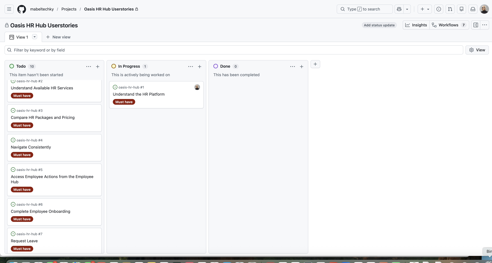

#### Structure

The Structure Plane focused on organising the content and features identified during Scope into clear user journeys. The information architecture was designed to keep navigation simple while separating business-focused information from employee-focused actions.

Oasis HR Hub consists of six HTML pages:

| Page | Purpose |
| --- | --- |
| `index.html` | Introduces Oasis HR Hub and contains the main business-facing content, including services, pricing and contact information. |
| `employee-hub.html` | Provides a central location for employees to access onboarding, leave requests and absence reporting. |
| `onboarding.html` | Provides the full employee onboarding journey through a structured form. |
| `faq.html` | Provides answers to common HR and workplace questions. |
| `team.html` | Introduces the HR professionals behind Oasis HR Hub. |
| `success.html` | Provides confirmation after a user submits one of the front-end forms. |

##### Navigation Structure

A consistent navigation system was planned across the website:

**Home | Services | Employee Hub | Meet the Team | FAQ | Contact**

Services and Contact are sections of the homepage rather than separate pages. This keeps related business information together and allows users to move directly to the relevant content without introducing unnecessary pages.

Employee actions are grouped within the Employee Hub. From this central area, an employee can:

- Start the onboarding process.
- Request leave through a modal form.
- Report an absence through a modal form.

The more detailed onboarding process uses its own page because it requires substantially more information than the shorter leave and absence forms.

##### Key User Journeys

The structure supports different journeys depending on the user's goal.

**Business owner/manager:**

`Home → Services → Pricing → Contact`

This journey allows a prospective client to understand the platform, explore the support available, compare service options and then make contact.

**New employee:**

`Employee Hub → Start Onboarding → Complete Onboarding Form → Submission Confirmation`

This provides a focused route through the onboarding process without requiring the employee to navigate through unrelated business content.

**Existing employee:**

`Employee Hub → Request Leave / Report Absence → Submission Confirmation`

Keeping these actions together within the Employee Hub provides employees with a clear starting point for common HR tasks.

#### Skeleton

The Skeleton Plane translated the information architecture into page layouts and established where key content, navigation, forms and interactive elements would appear before development began.

Low-fidelity wireframes were created in Balsamiq for mobile, tablet and desktop layouts. Designing across different screen sizes at this stage helped establish how content should reorganise responsively before Bootstrap was used to implement the layouts.

##### Wireframes

The wireframes were developed from the user stories and planned user journeys to provide a clear visual guide for the structure and layout of Oasis HR Hub before development began.

They show how the key pages and content were planned across different screen sizes, helping to guide the responsive design of the website.

[View the complete Oasis HR Hub wireframes](assets/images/documentation/oasis-hr-hub-wireframes.pdf)

Key layout decisions included:

- **Homepage** – content follows a natural journey from the introduction and primary onboarding call-to-action through services, pricing and contact information.
- **Services** – service information is presented as clearly separated content areas that can reorganise across different screen sizes.
- **Pricing** – packages are positioned for easy comparison while remaining readable when stacked on smaller devices.
- **Employee Hub** – onboarding, leave requests and absence reporting are grouped together to give employees one clear starting point for HR actions.
- **Onboarding** – the longer form is divided into logical sections to reduce cognitive load and make the information easier to complete.
- **FAQ** – questions use a single-column expandable structure to keep a potentially large amount of information manageable.
- **Meet the Team** – profiles are presented one at a time within a carousel to avoid overcrowding the page while still allowing users to browse the team.
- **Responsive forms** – related fields can appear alongside each other where sufficient space is available and stack vertically on smaller screens.

The wireframes provided the visual blueprint for development while leaving visual styling such as colour, typography and imagery to the Surface Plane.

#### Surface

The Surface Plane established the visual identity of Oasis HR Hub. The aim was to create an interface that feels professional and trustworthy while remaining warm, approachable and people-focused rather than overly corporate.

##### Visual Direction

The visual direction for Oasis HR Hub was inspired by a warm interior image by **curaits**, sourced from Unsplash. The image combines warm neutral tones, natural wood, dark structural details, greenery and subtle orange accents. These elements reflected the warm, professional and approachable character intended for the HR platform.

Rather than reproducing the interior design itself, the image was used as a visual reference when developing the website's colour palette. Colours were explored from the reference image and refined during development based on their intended use, readability, contrast and consistency across the interface.


[View the original inspiration image on Unsplash](https://unsplash.com/photos/living-room-with-sofa-and-partition-p_xTs-dajHk)

##### Colour Palette

The final Oasis HR Hub palette combines warm neutrals with natural colours to create a professional but approachable visual identity.

| Colour | Hex | Intended Use |
| --- | --- | --- |
| Deep Brown | `#3D1F14` | Primary headings and strong visual elements |
| Dark Green | `#2B5828` | Secondary colour and interface accents |
| Light Cream | `#FFF9F0` | Main page background and light text on dark backgrounds |
| Warm Greige | `#CDC0B6` | Navigation, footer and neutral interface areas |
| Warm Orange | `#FF9A5C` | Accent colour, hover states and interactive emphasis |

The palette was deliberately kept small to maintain visual consistency throughout the website. CSS custom properties were used to store the colours so that the same values could be reused consistently across the interface.

##### Accessibility and Colour Contrast

Accessibility was considered alongside the visual design when deciding how colours would be used throughout the interface.

The WebAIM Contrast Checker was used during development to test foreground and background colour combinations. This helped ensure that colours used for text and interactive elements provided sufficient contrast rather than relying on their visual appearance alone.

The following colour combinations were tested:

| Colour Combination | Contrast Ratio | Result |
| --- | ---: | --- |
| Deep Brown `#3D1F14` / Light Cream `#FFF9F0` | 14.28:1 | Pass |
| Deep Brown `#3D1F14` / Warm Greige `#CDC0B6` | 8.4:1 | Pass |
| Dark Green `#2B5828` / Light Cream `#FFF9F0` | 7.93:1 | Pass |
| Light Cream `#FFF9F0` / Dark Green `#2B5828` | 7.93:1 | Pass |
| Warm Orange `#FF9A5C` / Deep Brown `#3D1F14` | 7.14:1 | Pass |

###### Deep Brown and Light Cream

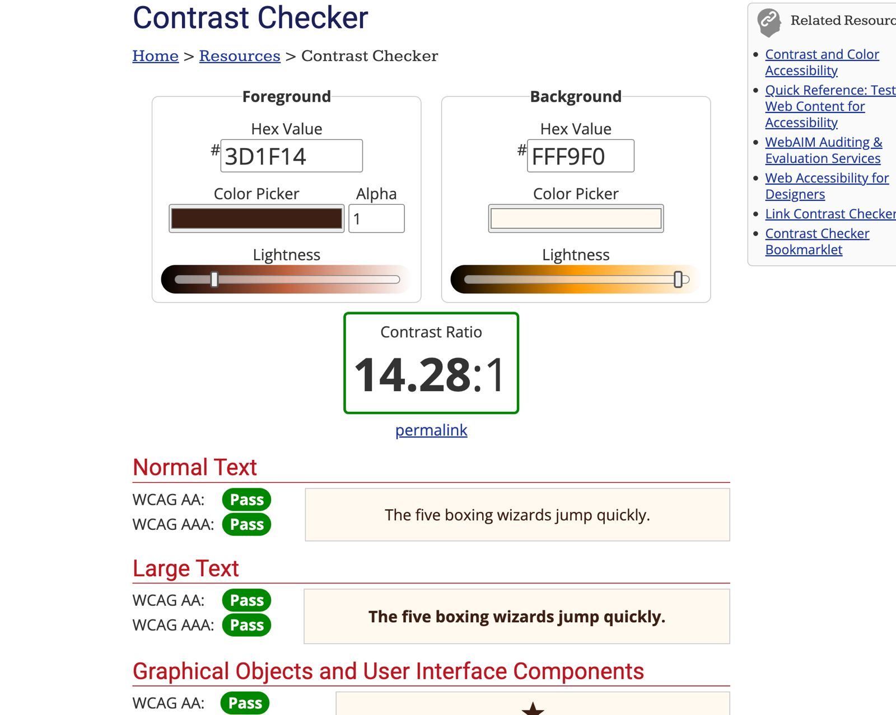

###### Deep Brown and Warm Greige

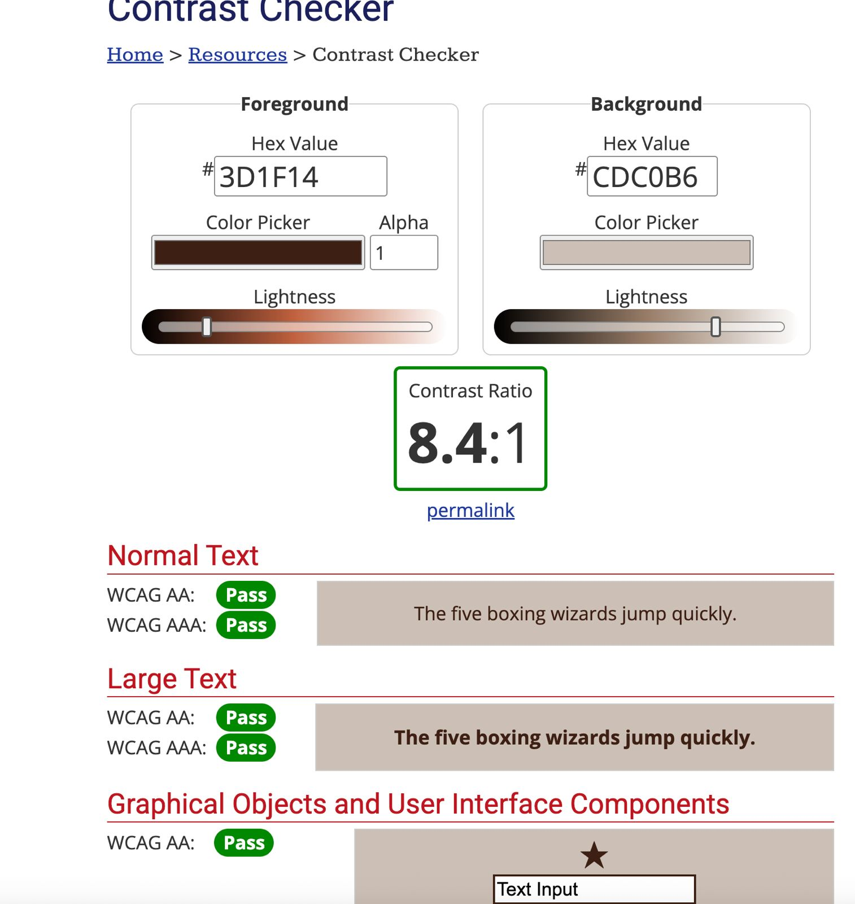

###### Dark Green and Light Cream

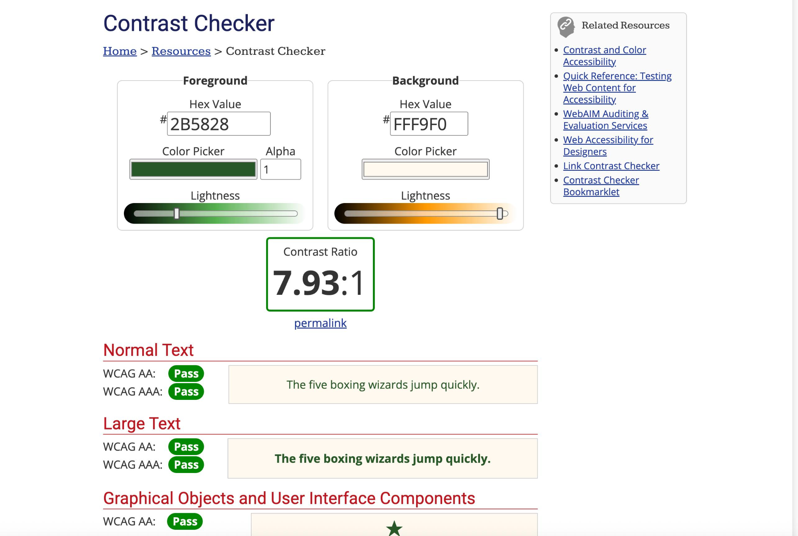

###### Light Cream and Dark Green

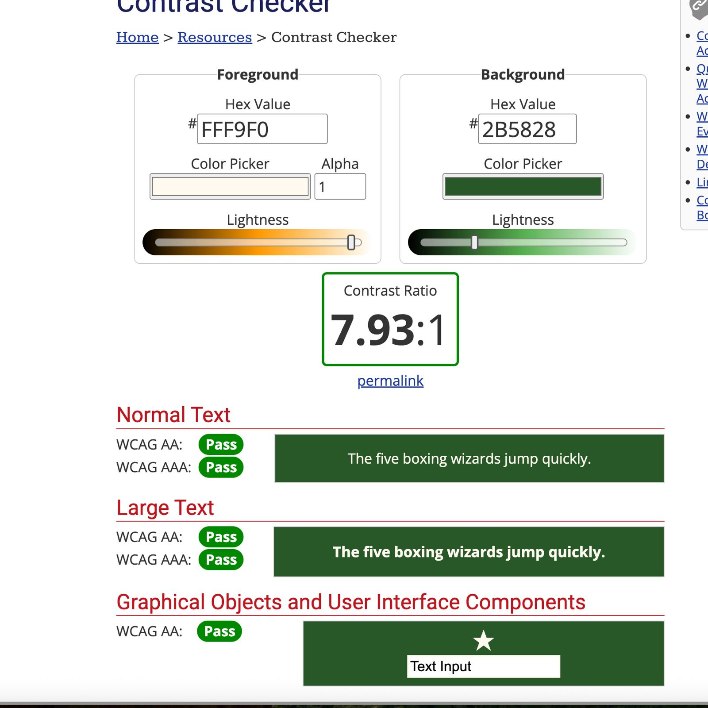

###### Warm Orange and Deep Brown

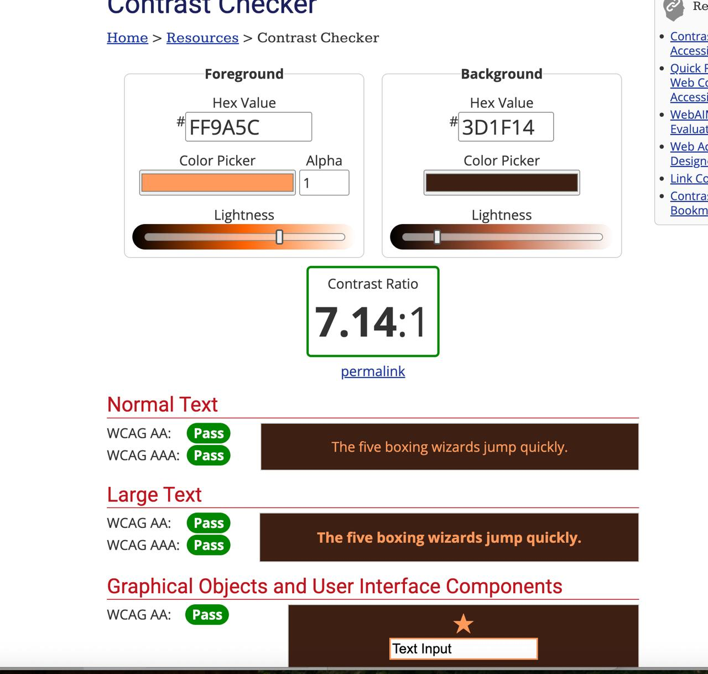

Navigation interaction was also considered as part of accessibility. Navigation links use an underline on hover and the active page is visually identified, providing an additional visual cue rather than relying solely on colour.

[Check colour contrast using WebAIM](https://webaim.org/resources/contrastchecker/)

##### Typography

**Inter** was selected as the primary typeface for Oasis HR Hub and is used consistently throughout the website.

The font was chosen for its clean, modern appearance and readability across different screen sizes. Using a single font family helps maintain visual consistency, while different font weights create a clear hierarchy between headings and body content.

The typography uses:

- **400 (Regular)** for body text and general content.
- **600 (Semi-Bold)** for smaller headings and elements requiring additional emphasis.
- **700 (Bold)** for primary and secondary headings.

Inter is imported from [Google Fonts](https://fonts.google.com/specimen/Inter), with `sans-serif` included as a fallback font family.

##### Logo and Brand Identity

A custom logo was developed for **Oasis HR Hub** to create a recognisable and consistent visual identity across the platform.

The logo uses a circular emblem incorporating the letters **H** and **R**, directly representing the Human Resources focus of the platform. Human and botanical elements are incorporated into the design to reflect the wider themes of people, support, development and growth.

The colours used within the logo complement the Oasis HR Hub colour palette, helping to maintain consistency between the brand identity and the wider website design. The circular format also creates a compact and recognisable brand mark that works effectively within the navigation area.

##### Favicon

A favicon was included to provide a recognisable Oasis HR Hub identifier within browser tabs and supported device shortcuts.

The Oasis HR Hub brand image was used to create the favicon, helping to maintain visual consistency between the website and its browser identity.

[Favicon.io](https://favicon.io/) was used to generate three favicon sizes:

- `favicon-16x16.png` – for standard browser tabs.
- `favicon-32x32.png` – for higher-resolution browser displays.
- `apple-touch-icon.png` – for supported Apple devices and shortcuts.

The appropriate favicon files are linked within the `<head>` section of the website so that browsers and devices can select the suitable version.

##### Imagery

Imagery within Oasis HR Hub was selected to support the professional, approachable and people-focused character of the platform.

Professional workplace imagery is used within the homepage and Employee Hub headers to reinforce the HR and workplace context of the website. The Meet the Team page uses professional portrait photographs to represent members of the HR team.

The team photographs were selected with similar framing and professional presentation to create a consistent appearance across the profiles. They are displayed within a Bootstrap carousel, allowing users to browse individual team members without overcrowding the page. Previous and next controls allow users to move between the profiles.

Alternative text is provided for meaningful images to support accessibility.

All team photographs were sourced from **Pexels**:

- `Photo by Nataliya Vaitkevich from Pexels: https://www.pexels.com/photo/woman-in-black-blazer-and-white-long-sleeve-shirt-8062305/`
- [Photo by Marcos Felipe on Pexels](https://www.pexels.com/photo/woman-in-black-dress-and-white-blazer-smiling-13331367/)
- [Photo by Joel Santos on Pexels](https://www.pexels.com/photo/smiling-woman-holding-chin-15780878/)
- [Photo by Ernest Flowers on Pexels](https://www.pexels.com/photo/professional-headshot-of-a-smiling-man-38677835/)
- [Photo by Tran Nhu Tuan on Pexels](https://www.pexels.com/photo/professional-woman-smiling-in-blue-business-suit-29995644/)

###### Image Sources

The homepage header uses a professional workplace meeting image to support the welcoming and approachable visual identity of Oasis HR Hub. The image reflects the platform's focus on practical HR support, professional guidance and communication within the workplace.

- Photo by [Vitaly Gariev](https://www.pexels.com/photo/professional-business-meeting-in-office-setting-36733333/) from Pexels.
- https://pixabay.com/photos/laptop-office-hand-writing-3196481/

The image is stored locally as `assets/images/header-image.jpg`
The image is stored locally as `assets/images/employee-hub-header-image.jpg`


## Design

The visual and layout decisions for Oasis HR Hub were developed from the UX planning described above. Wireframes were created before development to provide a visual reference for page structure, content hierarchy and responsive behaviour.

### Wireframes

Low-fidelity wireframes were created using **Balsamiq** for mobile, tablet and desktop screen sizes.

Creating the wireframes before coding made it possible to explore how the planned content and user journeys would translate into page layouts before implementing them with HTML, CSS and Bootstrap.

The wireframes cover the key areas of the platform and demonstrate how layouts adapt across different viewport sizes.

[View the Oasis HR Hub Wireframes]`(assets/images/documentation/oasis-hr-hub-wireframes.pdf)`

## Features

Oasis HR Hub includes a range of responsive features designed around the needs identified during the UX planning process. Each feature supports a specific user journey or business requirement and helps users navigate and interact with the platform.

### Navigation Bar

Oasis HR Hub uses a responsive navigation bar across the website to provide users with consistent access to its main pages and sections.

The Oasis HR Hub logo appears on the left as the primary brand identifier. On larger screens, the navigation links are displayed on the right side of the navigation bar. On smaller screens, the navigation collapses into a Bootstrap hamburger menu, allowing the links to remain accessible without overcrowding the available screen space.

The navigation provides the following options:

- **Home** – takes the user to the homepage of Oasis HR Hub.
- **Services** – takes the user directly to the Services section of the homepage, where the HR support services available through the platform are presented.
- **Employee Hub** – opens the Employee Hub, where employees can access workplace self-service options and begin common HR processes.
- **Meet the Team** – opens the Meet the Team page, where users can view members of the HR team and their roles.
- **FAQ** – opens the Frequently Asked Questions page, where users can expand individual questions to view the answers.
- **Contact** – takes the user directly to the Contact section of the homepage, where contact details, business hours and social media links are provided.

The current page is visually identified within the navigation, helping users understand where they are within the website. Navigation links also display an underline on hover to provide additional visual feedback when a link is interactive.

On smaller screens, selecting the hamburger button expands the navigation menu vertically. When a navigation link is selected, the menu collapses and the user is taken to the selected page or section, while the active page remains visually identified within the navigation.
### Home Page

The Home page is the main entry point to Oasis HR Hub and introduces users to the purpose of the platform and the HR support available.

The header section includes a professional workplace image and a **Start Onboarding** call-to-action. When the user selects **Start Onboarding**, they are taken to the Employee Onboarding form, where they can enter and submit the information required for the onboarding process.

The Home page also encompasses the **Services**, **Pricing** and **Contact** sections described below. These sections allow users to explore the HR services provided, view pricing information and access the contact details for Oasis HR Hub without having to navigate to separate pages.

#### Services

The Services section is located on the Home page and provides users with information about the HR services available through Oasis HR Hub.

The services are presented in individual cards, using headings, icons and short descriptions to help users quickly understand the different areas of HR support provided.

When a user selects **Services** from the navigation bar, they are taken directly to the Services section of the Home page rather than to a separate page. Users can also reach the section naturally by scrolling through the Home page.

The service cards are arranged responsively so that they adapt to different screen sizes, remaining clear and easy to read across mobile, tablet and desktop devices.

#### Pricing

The Pricing section is also located on the Home page and provides users with information about the pricing options available for the HR services offered through Oasis HR Hub.

The pricing information is presented clearly so that users can compare the available options and understand what is included before deciding which level of HR support may be appropriate for their needs.

As part of the Home page, the Pricing section can be reached by scrolling through the page and remains responsive across different screen sizes.

#### Contact

The Contact section appears on the Home page and provides users with the information required to get in touch with Oasis HR Hub.

The section includes contact details such as the email address and telephone number, together with the business opening hours. Social media icons are also provided to give users additional ways to connect with Oasis HR Hub.

When a user selects **Contact** from the navigation bar, they are taken directly to the Contact section of the Home page rather than to a separate Contact page.

The email address and telephone number are presented as clickable links, allowing users to begin an email or telephone contact using a supported device or application. The social media icons are also presented as interactive links.

The Contact section uses a responsive layout so that the contact information and business hours remain clearly presented across mobile, tablet and desktop screen sizes.

### Employee Hub

The Employee Hub is a dedicated page that provides employees with quick access to common HR self-service processes. It brings these actions together in one place so that employees can easily identify and access the support they need.

The Employee Hub provides access to **Start Onboarding**, **Request Leave** and **Report Absence**.

When the user selects **Start Onboarding**, they are taken to the Employee Onboarding page, where they can complete and submit the onboarding form.

When the user selects **Request Leave**, a modal form is displayed on the Employee Hub page. This allows the employee to enter the required leave information without navigating away from the page.

When the user selects **Report Absence**, a modal form is displayed, allowing the employee to provide the required information about their absence.

The use of modal forms for the leave and absence processes allows employees to complete these common HR actions while remaining within the Employee Hub.

The Employee Hub uses a responsive layout so that its content and employee self-service options remain accessible across mobile, tablet and desktop screen sizes.

### Meet the Team

The Meet the Team page introduces users to the HR professionals represented within Oasis HR Hub. It helps create a more approachable and people-focused experience by allowing users to see the individuals associated with different areas of HR support.

The team members are presented within a responsive Bootstrap carousel. Each carousel slide displays a professional photograph of a team member together with their name and HR role.

The carousel includes **Previous** and **Next** controls. When a user selects either control, the carousel moves to the previous or next team member, allowing users to browse the individual profiles without displaying all of the team members on the page at the same time.

Five HR team members are presented within the carousel:

- **Daniel Brooks** – HR Manager
- **Grace Thompson** – HR Support Advisor
- **Amelia Carter** – Recruitment Advisor
- **Sophia Williams** – Training & Development Advisor
- **Emily Harrison** – HR Compliance Advisor

The layout also responds to different screen sizes. On smaller screens, the introductory content and carousel are displayed vertically, while on larger screens they are positioned alongside each other to make effective use of the available space.

Alternative text is provided for the team images to support users who rely on assistive technologies.
The photographs used for the Meet the Team profiles can be found in the **Imagery** section of this README, together with their original image sources.

### FAQ

The FAQ page provides users with answers to common questions about the HR services and employee support available through Oasis HR Hub.

Eight frequently asked questions are presented using a Bootstrap accordion. This keeps the page organised by displaying the questions while allowing users to choose which answers they want to view.

When a user selects a question, the accordion expands to display the corresponding answer. The user can then collapse the answer or select another question to view additional information.

This approach prevents large amounts of information from being displayed at once and allows users to quickly locate the information that is relevant to them.

The accordion is responsive and remains easy to use across mobile, tablet and desktop screen sizes. The questions can also receive keyboard focus, supporting users who navigate the website using a keyboard.

### Footer

A consistent footer is included across the Oasis HR Hub website to provide a clear visual ending to each page and maintain consistency throughout the platform.

The footer displays the Oasis HR Hub copyright information and uses the same colour palette and styling as the rest of the website, reinforcing the overall visual identity.

Its simple design keeps the focus on the main page content while ensuring that users have a consistent experience when reaching the bottom of each page.

The footer is responsive and remains clearly displayed across mobile, tablet and desktop screen sizes.

## Technologies Used

The following technologies were used to build and manage the Oasis HR Hub project:

- **HTML5** – used to structure the content and pages of the website.
- **CSS3** – used to create the custom styling and visual presentation of the website.
- **Bootstrap 5** – used to support responsive layouts and components including the navigation bar, grid system, cards, forms, modals, accordion and carousel.
- **Google Fonts** – used to import the Inter typeface used throughout the website.
- **Font Awesome** – used to provide icons within the website.
- **Git** – used for version control throughout the development of the project.
- **GitHub** – used to store the project repository and maintain the development history.

### Google's Lighthouse Performance

Google Lighthouse was used to assess the performance, accessibility, best practices and SEO of the main pages of Oasis HR Hub.

The Lighthouse tests produced the following results:

| Page | Performance | Accessibility | Best Practices | SEO |
| --- | ---: | ---: | ---: | ---: |
| Home | 92 | 100 | 100 | 91 |
| Employee Hub | 91 | 100 | 100 | 91 |
| FAQ | 85 | 100 | 100 | 91 |
| Meet the Team | 70 | 100 | 100 | 91 |

The Home page and Employee Hub achieved performance scores above 90. The FAQ page achieved a performance score of 85, while the Meet the Team page achieved a performance score of 70.

All four pages achieved scores of **100 for Accessibility** and **100 for Best Practices**, with a consistent **SEO score of 91**.

Performance scores varied between pages, with the Meet the Team page recording the lowest performance score. Lighthouse results can vary depending on factors such as image loading, browser conditions and the environment in which the test is carried out.

#### Home Page Lighthouse Result

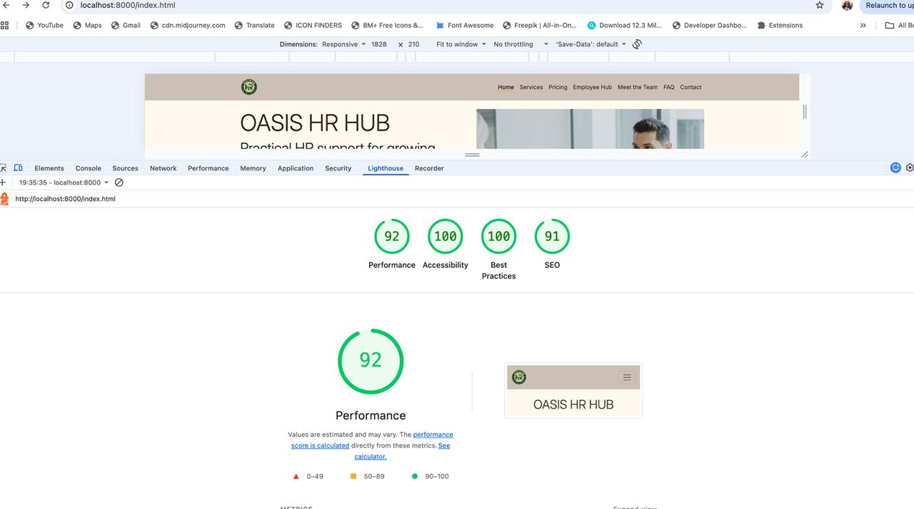

#### Employee Hub Lighthouse Result

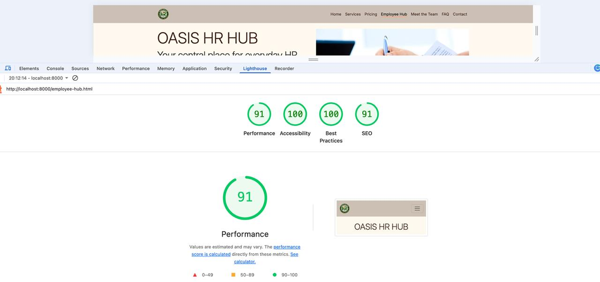

#### FAQ Lighthouse Result

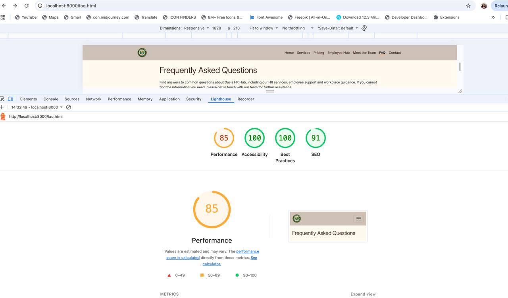

#### Meet the Team Lighthouse Result

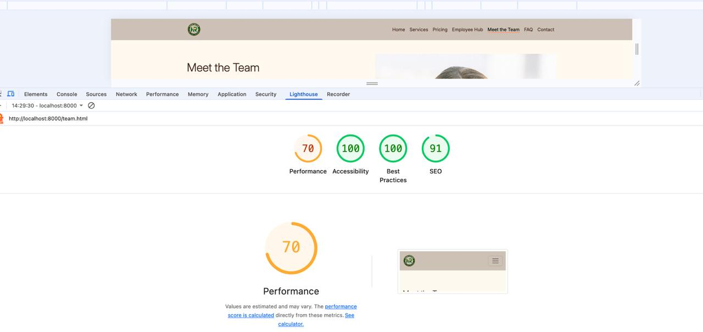

### Browser Compatibility

Oasis HR Hub was tested across different browsers and devices to confirm that the deployed website displays correctly and that its main features remain functional.

Development and the majority of testing were carried out using **Google Chrome on macOS**. The deployed website was also tested using **Safari on macOS** and **Safari on iOS**.

| Browser | Device/Platform | Result |
| --- | --- | --- |
| Google Chrome | macOS | Pass |
| Safari | macOS | Pass |
| Safari | iOS | Pass |

Testing confirmed that the website layout, navigation, images and interactive features displayed and functioned correctly across the browsers tested.

On Safari for macOS, the desktop layout displayed correctly, including the navigation bar, page content, images and responsive sections.

On Safari for iOS, the website adapted correctly to the smaller screen size. The desktop navigation collapsed into a hamburger menu, which expanded vertically when selected. Selecting a navigation link closed the menu and took the user to the selected page or section. Page content, including the Home page, Employee Hub, Meet the Team carousel and FAQ accordion, also adapted appropriately to the mobile screen.

#### Safari on macOS

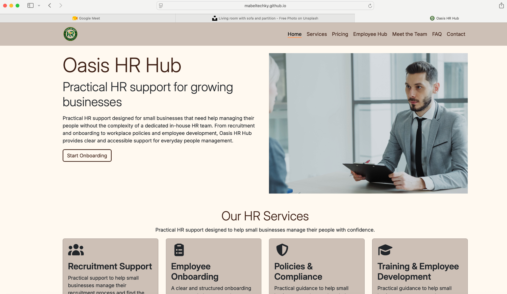

#### Safari on iOS

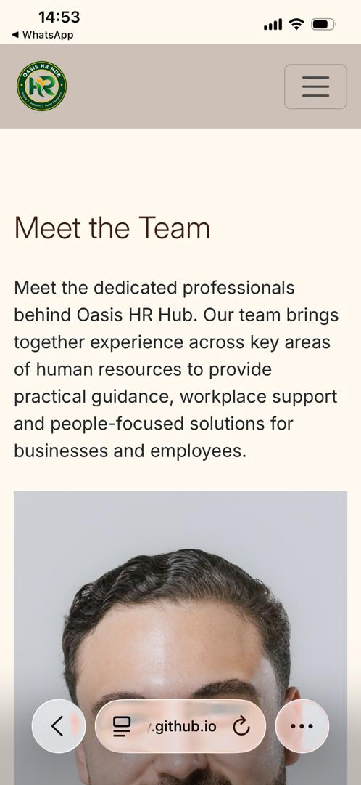

### Responsiveness

Oasis HR Hub was designed using a mobile-first approach and Bootstrap's responsive grid system to ensure that the website remains usable and visually consistent across different screen sizes.

Responsiveness was tested during development using Google Chrome DevTools and was also checked on physical devices, including a MacBook and an iPhone.

Testing confirmed that the website adapts appropriately as the available screen width changes. On larger screens, content makes use of the additional horizontal space, while on smaller screens elements are rearranged or stacked vertically to maintain readability and usability.

The responsive behaviour observed during testing included:

- The navigation bar collapses into a hamburger menu on smaller screens.
- Home page content adapts to the available screen width and stacks appropriately on mobile devices.
- Service and pricing content rearranges responsively rather than overflowing the viewport.
- Employee Hub content and self-service options remain accessible on smaller screens.
- The Employee Onboarding form adjusts to the available screen width, allowing form fields and controls to remain accessible on mobile devices.
- The Meet the Team introductory content and carousel stack vertically on smaller screens, while larger screens make use of a side-by-side layout.
- The FAQ accordion remains readable and usable on smaller screens.
- Forms and interactive components adjust to the available screen width without horizontal scrolling.

#### Home Page on Mobile

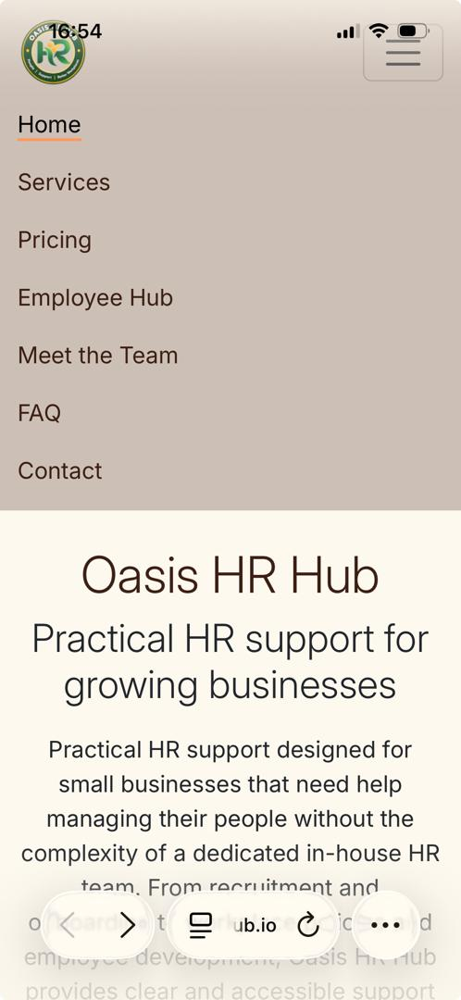

#### Employee Hub on Mobile

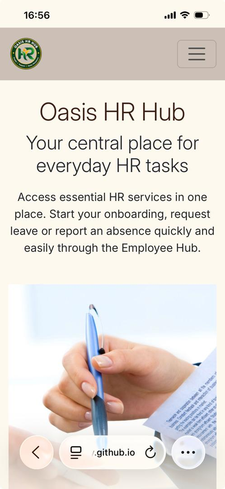

#### Employee Onboarding Form on Mobile

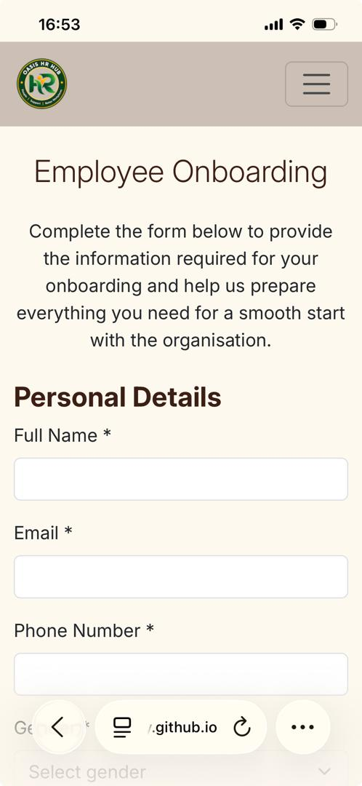

#### Meet the Team on Mobile

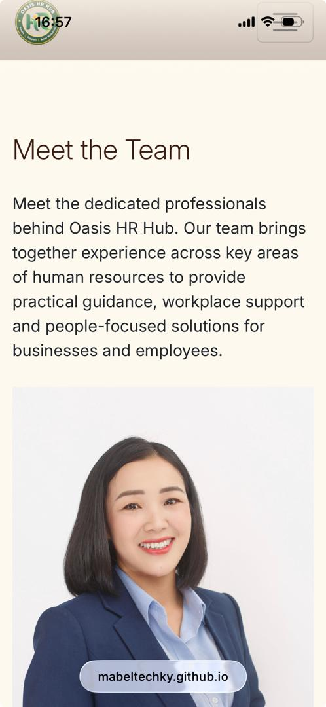

#### FAQ on Mobile

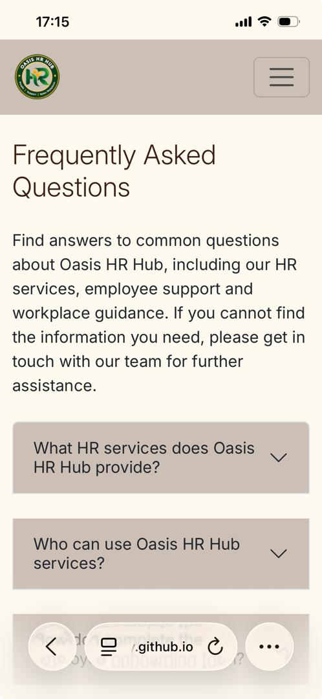

### Code Validation

The HTML and CSS used throughout Oasis HR Hub were validated to identify syntax errors and confirm that the code follows recognised web standards.

The **W3C Nu HTML Checker** was used to validate each HTML page individually. The following pages were tested:

- `index.html`
- `employee-hub.html`
- `faq.html`
- `onboarding.html`
- `success.html`
- `team.html`

The **W3C CSS Validation Service** was used to validate the project's CSS.

During development, validation identified issues that were reviewed and corrected where appropriate. The final validation results were recorded and screenshots were retained as evidence of the testing carried out.

#### Home Page HTML Validation

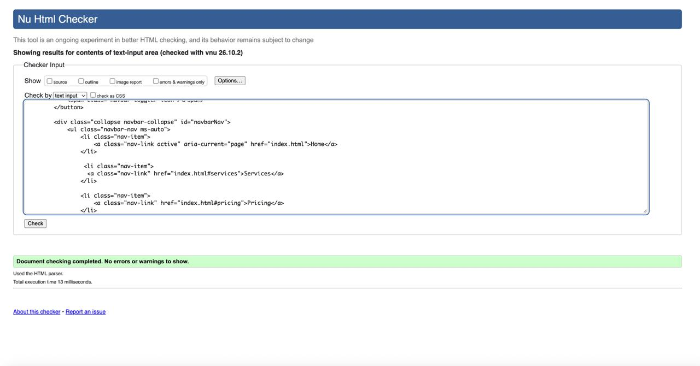

#### Employee Hub HTML Validation

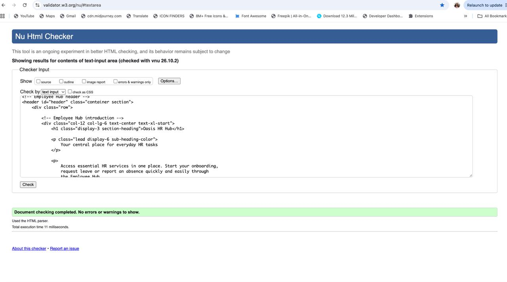

#### FAQ HTML Validation

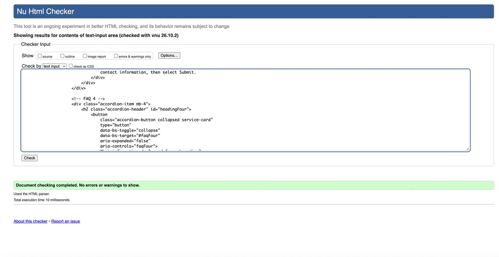

#### Employee Onboarding HTML Validation

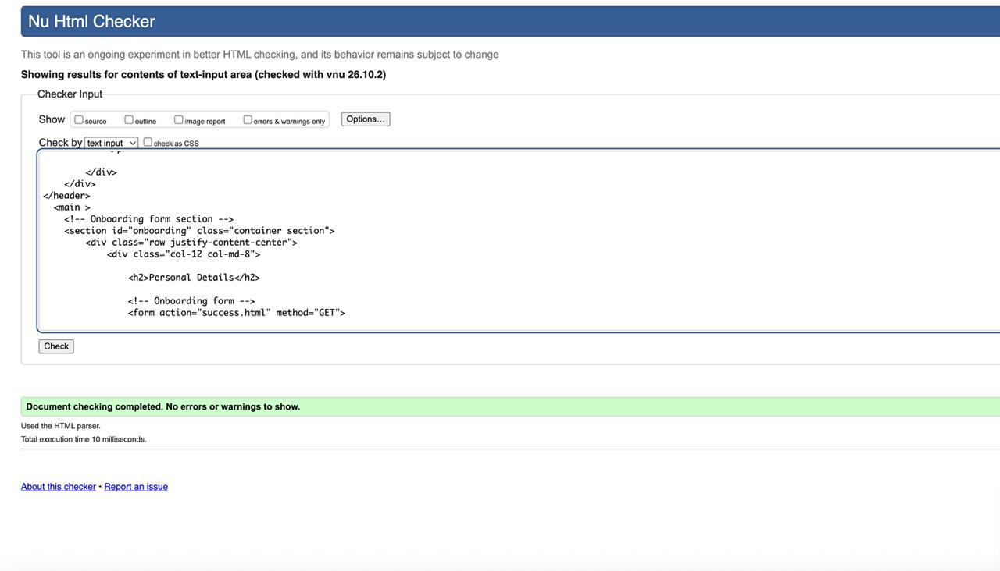

#### Success Page HTML Validation

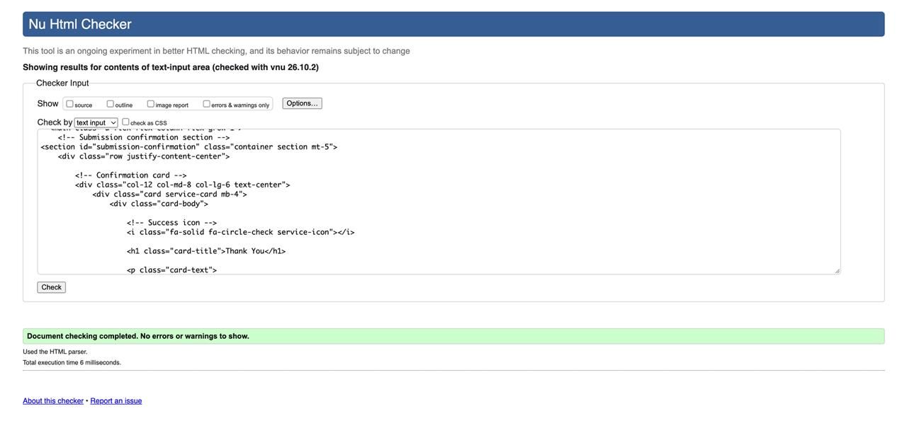

#### Meet the Team HTML Validation

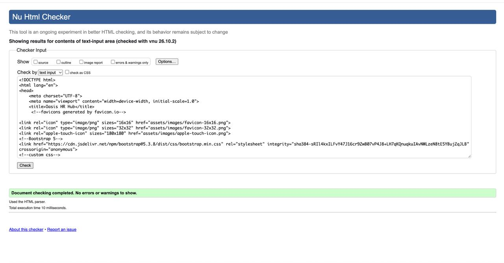

#### CSS Validation

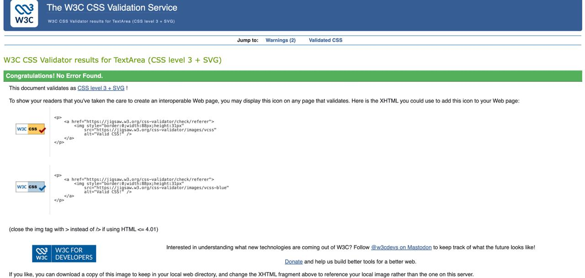

The CSS validator also displayed warnings relating to the imported Google Fonts stylesheet and the use of the same colour for the background and border of the custom button hover state. These warnings did not prevent the CSS from functioning as intended.

### Manual Testing – User Stories

Manual testing was carried out against the acceptance criteria defined for each user story. Each acceptance criterion was tested to confirm that the implemented feature or behaviour works as intended.

| User Story | Acceptance Criteria | Manual Test | Result |
| --- | --- | --- | --- |
| **US01 – Understand the HR Platform** | The purpose of the HR platform is immediately understandable from the homepage. | Opened the homepage and confirmed that the introductory content clearly communicates the purpose of Oasis HR Hub. | Pass |
| US01 | A clear main heading and introductory text are displayed. | Opened the homepage and confirmed that the main heading and introductory text are clearly visible. | Pass |
| US01 | A prominent **Start Onboarding** CTA is visible and opens `onboarding.html`. | Selected **Start Onboarding** and confirmed that the Employee Onboarding page opened correctly. | Pass |
| US01 | HR Services, Pricing & Packages and Contact information can be reached easily from the homepage. | Navigated through the homepage and confirmed that the Services, Pricing and Contact sections are accessible. | Pass |
| US01 | The Contact/Footer section clearly displays an email address and phone number. | Checked the Contact/Footer section and confirmed that both the email address and phone number are clearly displayed. | Pass |
| US01 | Social-media links/icons are available within the Contact/Footer section. | Checked the Contact/Footer section and confirmed that the social-media icons are displayed as interactive links. | Pass |
| US01 | Business opening days and corresponding opening hours are clearly presented in a structured table. | Checked the business-hours area and confirmed that the opening days and corresponding hours are presented in a structured table. | Pass |
| US01 | Opening-hours table rows provide clear visual feedback when hovered over on devices that support hover. | Hovered over the opening-hours table rows on a desktop device and confirmed that visible hover feedback is provided. | Pass |
| US01 | Copyright/site information is displayed within the footer. | Checked the footer and confirmed that the copyright/site information is displayed. | Pass |
| US01 | Selecting **Contact** directs the user to the Contact/Footer section. | Selected **Contact** from the navigation and confirmed that the browser moved to the Contact section of the homepage. | Pass |
| US01 | Interactive CTAs provide visible feedback when hovered over on devices that support hover and when focused using a keyboard. | Tested the interactive CTA using mouse hover and keyboard navigation and confirmed that visible hover and focus feedback is provided. | Pass |
| US01 | Homepage content, including the Contact/Footer and opening-hours table, remains readable and usable across mobile, tablet and desktop screen sizes. | Tested the homepage at mobile, tablet and desktop screen sizes and confirmed that the content, Contact/Footer and opening-hours table remained readable and usable. | Pass |
| **US02 – Understand Available HR Services** | All four agreed HR service areas are displayed. | Checked the Services section and confirmed that Recruitment Support, Employee Onboarding, Policies & Compliance, and Training & Employee Development are displayed. | Pass |
| US02 | Each service has a clear title, appropriate icon and concise explanation. | Checked each service card and confirmed that it contains a clear title, icon and description. | Pass |
| US02 | Services are presented as visually distinct cards. | Confirmed that the four services are displayed as separate Bootstrap cards. | Pass |
| US02 | Selecting **Services** from the navigation takes the user to the Services section on the homepage. | Selected **Services** from the navigation and confirmed that the browser moved to the Services section of the homepage. | Pass |
| US02 | When navigating from another page, the Services link returns the user to `index.html#services`. | Selected **Services** while on another page and confirmed that the browser returned to the Services section of the homepage. | Pass |
| US02 | The Services heading/relevant content remains visible rather than being obscured by the fixed navigation. | Used the Services navigation link and confirmed that the Services heading and relevant content remained visible. | Pass |
| US02 | Service cards adapt appropriately to different screen sizes. | Tested the Services section at different screen sizes and confirmed that the cards adapt appropriately without horizontal overflow. | Pass |
| **US03 – Compare HR Packages and Pricing** | Available packages are clearly distinguishable. | Viewed the Pricing section and confirmed that each package is presented separately and can be clearly distinguished from the others. | Pass |
| US03 | Each package displays its name, price and included services/features. | Checked each pricing card and confirmed that the package name, price and included services/features are displayed. | Pass |
| US03 | Users can compare the package information easily. | Reviewed the pricing cards together and confirmed that their consistent presentation allows the package information to be compared easily. | Pass |
| US03 | Each package provides a Contact Us CTA. | Checked each pricing card and confirmed that a **Contact Us** CTA is provided. | Pass |
| US03 | Selecting Contact Us takes the user to the Contact information rather than implying an unsupported online checkout. | Selected the **Contact Us** CTA and confirmed that it directed the user to the Contact section rather than to an online checkout. | Pass |
| US03 | Pricing cards remain usable across mobile, tablet and desktop devices. | Tested the Pricing section at mobile, tablet and desktop screen sizes and confirmed that the cards remain readable and usable. | Pass |
| **US04 – Navigate Consistently Across the Platform** | Navigation appears consistently throughout the platform. | Opened the different pages of the website and confirmed that the navigation is presented consistently throughout the platform. | Pass |
| US04 | Logo and navigation positioning is appropriate on larger screens. | Viewed the website on a larger screen and confirmed that the logo and navigation links are positioned appropriately. | Pass |
| US04 | All navigation items lead to their intended pages or sections. | Selected each navigation item and confirmed that it leads to its intended page or homepage section. | Pass |
| US04 | Cross-page Services and Contact links correctly return users to the relevant homepage sections. | Selected Services and Contact while on other pages and confirmed that both links returned to their respective sections on the homepage. | Pass |
| US04 | Navigation collapses appropriately on smaller screens. | Tested the website at a smaller screen size and confirmed that the navigation collapses into the hamburger menu. | Pass |
| US04 | The mobile menu does not unnecessarily remain open after navigation. | Opened the mobile navigation, selected a navigation link and confirmed that the menu did not remain unnecessarily open after navigation. | Pass |
| US04 | Anchored content is visible below the fixed navbar. | Used the homepage anchor navigation links and confirmed that the relevant content remained visible rather than being obscured by the navbar. | Pass |
| US04 | The footer consistently provides Contact information, social links/icons and copyright/site information. | Checked the Contact/Footer content and confirmed that Contact information, social links/icons and copyright/site information are provided as designed. | Pass |
| US04 | There are no broken internal navigation links. | Tested the internal navigation links throughout the website and confirmed that they lead to valid destinations. | Pass |
| **US05 – Access Employee Actions from the Employee Hub** | Employee Hub is accessible from the main navigation. | Selected **Employee Hub** from the main navigation and confirmed that the Employee Hub page opened correctly. | Pass |
| US05 | Its purpose is clear to employees. | Opened the Employee Hub and confirmed that the heading and introductory content clearly explain the purpose of the page. | Pass |
| US05 | Start Onboarding, Request Leave and Report Absence are clearly distinguishable. | Checked the Employee Hub and confirmed that Start Onboarding, Request Leave and Report Absence are presented as three clearly distinguishable actions. | Pass |
| US05 | Each action has a clear explanation and CTA. | Checked each Employee Hub action and confirmed that it includes an explanation and an appropriate CTA. | Pass |
| US05 | Start Onboarding opens `onboarding.html`. | Selected **Start Onboarding** and confirmed that the Employee Onboarding page opened correctly. | Pass |
| US05 | Request Leave opens the correct leave modal. | Selected **Request Leave** and confirmed that the Leave Request modal opened. | Pass |
| US05 | Report Absence opens the correct absence modal. | Selected **Report Absence** and confirmed that the Absence Report modal opened. | Pass |
| US05 | Employee Hub remains usable across different screen sizes. | Tested the Employee Hub at different screen sizes and confirmed that its content, cards and actions remain accessible and usable. | Pass |
| **US06 – Complete Employee Onboarding** | The onboarding page contains clearly organised form sections. | Opened the onboarding page and confirmed that the form is divided into clearly organised sections. | Pass |
| US06 | All agreed Personal, Employment, Right-to-Work and Emergency Contact information can be entered. | Completed the Personal Details, Employment Details, Right-to-Work Information and Emergency Contact sections and confirmed that the agreed information can be entered. | Pass |
| US06 | Start date uses an appropriate date input. | Selected the Start Date field and confirmed that an appropriate date input is provided. | Pass |
| US06 | Right-to-work expiry information can be supplied where applicable without incorrectly requiring an expiry date from every employee. | Tested the Right-to-Work section and confirmed that expiry information can be provided where applicable without requiring an expiry date from every employee. | Pass |
| US06 | Form controls have clear labels. | Reviewed the onboarding form controls and confirmed that each has a clear and understandable label. | Pass |
| US06 | Required fields use appropriate front-end validation. | Attempted to submit the form without completing required fields and confirmed that front-end validation prevented submission and identified the required information. | Pass |
| US06 | The form can be completed on mobile, tablet and desktop. | Tested the onboarding form at mobile, tablet and desktop screen sizes and confirmed that the form remains usable. | Pass |
| US06 | Successful submission directs the user to `success.html`. | Completed the required form fields and submitted the onboarding form, confirming that the Success page opened. | Pass |
| US06 | The interface does not claim that information has been stored in a database. | Reviewed the onboarding and confirmation wording and confirmed that no claim is made that the submitted information has been stored in a database. | Pass |
| **US07 – Request Leave** | Selecting Request Leave opens the correct modal without navigating to an unnecessary additional page. | Selected **Request Leave** from the Employee Hub and confirmed that the Leave Request modal opened on the same page. | Pass |
| US07 | The employee can provide the information required for the leave request. | Entered information into the Leave Request form and confirmed that the required leave details can be provided. | Pass |
| US07 | Appropriate date controls are provided for the leave period. | Checked the leave-period fields and confirmed that appropriate date controls are provided. | Pass |
| US07 | Form fields have clear labels and required fields are validated. | Reviewed the form labels and attempted submission with required information missing, confirming that front-end validation is provided. | Pass |
| US07 | The user can close the modal without submitting. | Opened the Leave Request modal and used the close control, confirming that the modal could be closed without submitting the form. | Pass |
| US07 | Successful submission directs the user to `success.html`. | Completed the required Leave Request fields, submitted the form and confirmed that the Success page opened. | Pass |
| US07 | The interface does not claim that the request has been stored, approved or added to a leave balance. | Reviewed the Leave Request and confirmation wording and confirmed that no claim is made that the request has been stored, approved or added to a leave balance. | Pass |
| US07 | The modal remains usable on smaller screens. | Tested the Leave Request modal at a smaller screen size and confirmed that the form remains accessible and usable. | Pass |
| **US08 – Report an Absence** | Selecting Report Absence opens the correct modal. | Selected **Report Absence** from the Employee Hub and confirmed that the Absence Report modal opened. | Pass |
| US08 | Employees can provide the agreed absence information. | Entered information into the Absence Report form and confirmed that the agreed absence details can be provided. | Pass |
| US08 | Appropriate date controls are available. | Checked the absence-related date fields and confirmed that appropriate date controls are available. | Pass |
| US08 | Form controls have clear labels and required fields are validated. | Reviewed the form labels and attempted submission with required information missing, confirming that front-end validation is provided. | Pass |
| US08 | The modal can be closed without submitting. | Opened the Absence Report modal and used the close control, confirming that the modal could be closed without submitting. | Pass |
| US08 | Successful submission directs the employee to `success.html`. | Completed the required Absence Report fields, submitted the form and confirmed that the Success page opened. | Pass |
| US08 | The interface does not claim that absence information has been stored or processed by an HR database. | Reviewed the Absence Report and confirmation wording and confirmed that no claim is made that the information has been stored or processed by an HR database. | Pass |
| US08 | The modal remains usable across supported screen sizes. | Tested the Absence Report modal at different screen sizes and confirmed that it remains accessible and usable. | Pass |
| **US09 – Receive Submission Confirmation** | Onboarding, Leave Request and Absence Report submissions can all reach the shared success page. | Submitted the Onboarding, Leave Request and Absence Report forms and confirmed that all three submission journeys reach the shared Success page. | Pass |
| US09 | A clear success/confirmation message is displayed. | Opened the Success page after form submission and confirmed that a clear submission confirmation message is displayed. | Pass |
| US09 | Confirmation wording is appropriate for all three form journeys. | Reached the Success page from the onboarding, leave and absence forms and confirmed that the general confirmation wording is suitable for all three journeys. | Pass |
| US09 | No unsupported backend processing or data storage is claimed. | Reviewed the Success page wording and confirmed that it does not claim that information has been processed or stored by a backend system. | Pass |
| US09 | The user can return to the homepage easily. | Selected the **Return Home** CTA and confirmed that the homepage opened correctly. | Pass |
| US09 | Navigation and footer remain consistent with the rest of the platform. | Compared the navigation and footer on the Success page with the rest of the website and confirmed consistent presentation. | Pass |
| US09 | The page displays correctly across different screen sizes. | Tested the Success page at different screen sizes and confirmed that the content remains readable and usable. | Pass |
| **US10 – Find Answers to Common HR Service Questions** | FAQ is accessible directly from the navbar. | Selected **FAQ** from the navigation and confirmed that the FAQ page opened correctly. | Pass |
| US10 | The purpose of the page is immediately clear. | Opened the FAQ page and confirmed that the heading and introductory content clearly explain the purpose of the page. | Pass |
| US10 | Common questions and answers are presented using an accordion. | Checked the FAQ content and confirmed that the questions and answers are presented using a Bootstrap accordion. | Pass |
| US10 | Individual answers can be expanded and collapsed. | Selected different FAQ questions and confirmed that individual answers expand and collapse correctly. | Pass |
| US10 | Questions are relevant to the HR service offered by the platform. | Reviewed the FAQ questions and confirmed that they relate to the HR services and support provided by Oasis HR Hub. | Pass |
| US10 | Users can reach Contact information if further support is required. | Selected **Contact** from the FAQ page and confirmed that the user is taken to the Contact section of the homepage. | Pass |
| US10 | FAQ content remains readable and functional across different screen sizes. | Tested the FAQ page at different screen sizes and confirmed that the accordion remains readable and functional. | Pass |
| **US11 – Learn About the HR Team** | Meet the Team is accessible from the main navigation. | Selected **Meet the Team** from the navigation and confirmed that the Meet the Team page opened correctly. | Pass |
| US11 | The page explains its purpose. | Opened the Meet the Team page and confirmed that the heading and introductory content clearly explain its purpose. | Pass |
| US11 | Each profile contains the agreed team information. | Navigated through the team profiles and confirmed that each profile contains the agreed team information. | Pass |
| US11 | Profiles automatically progress at an appropriate interval. | Observed the carousel and confirmed that it automatically progresses through the team profiles. | Pass |
| US11 | Previous and Next controls allow manual navigation in both directions. | Used the **Previous** and **Next** carousel controls and confirmed that the profiles can be navigated in both directions. | Pass |
| US11 | Users can return to an earlier profile if they require more reading time. | Advanced through the carousel and used the Previous control to return to an earlier team profile. | Pass |
| US11 | Team content remains readable and usable across different screen sizes. | Tested the Meet the Team page at different screen sizes and confirmed that the content and carousel remain readable and usable. | Pass |

## Bugs and Fixes

During the development and testing of Oasis HR Hub, several issues were identified and resolved. The table below records the main bugs encountered and the steps taken to correct them.

| Bug / Issue | Fix |
| --- | --- |
| **Homepage styling stopped displaying correctly** – The page background and other styles appeared to stop working as expected. Investigation showed that a semicolon was missing after `text-transform: capitalize` in the CSS, which affected the rules that followed it. | Added the missing semicolon to the CSS rule and retested the website. The expected styling was restored. |
| **Employee Onboarding form appeared more than once during development** – While building the form, following separate code examples caused form markup to be repeated, resulting in duplicated form content on the page. | Reviewed the HTML structure, removed the duplicated markup and retained one complete onboarding form with the required fields and layout. |
| **Employee Onboarding form appeared incorrectly aligned** – The form initially appeared uneven in relation to the surrounding content, which made it seem as though the Bootstrap columns were not aligning correctly. | Reviewed the Bootstrap grid structure and the content surrounding the form. The layout was corrected and retested at different screen sizes to confirm consistent alignment. |
| **Meet the Team images displayed inconsistently in the carousel** – The team photographs had different original dimensions, causing inconsistent image presentation when moving between carousel slides. | Applied a consistent image height together with `object-fit: cover` and `object-position: top` so that each photograph displays consistently while maintaining its proportions. |
| **Large image files reduced Lighthouse performance** – Some images used on the website had unnecessarily large file sizes, contributing to slower page loading and lower performance results. | Optimised the affected images to reduce their file sizes while retaining suitable image quality, then repeated Lighthouse testing. |
| **HTML validation identified errors during development** – Validation testing highlighted markup that required correction before the final version of the website. | Reviewed the issues reported by the W3C Nu HTML Checker, corrected the affected HTML and validated each page again to confirm the final markup. |

## Deployment

Oasis HR Hub was deployed using **GitHub Pages**, allowing the completed website to be accessed online directly from the project's GitHub repository.

### Live Website

The deployed Oasis HR Hub website can be viewed here:

[View the live Oasis HR Hub website](https://mabeltechky.github.io/oasis-hr-hub/)

### Deploying to GitHub Pages

The following steps were used to deploy the project:

1. Log in to GitHub and open the **Oasis HR Hub** repository.
2. Select **Settings** from the repository navigation.
3. Select **Pages** from the sidebar.
4. Under **Build and deployment**, select **Deploy from a branch** as the source.
5. Select the `main` branch and the `/ (root)` folder.
6. Select **Save**.
7. GitHub Pages then builds and publishes the website.
8. Once deployment is complete, the live website URL is available from the GitHub Pages section of the repository settings.

Changes pushed to the `main` branch are reflected on the deployed website after GitHub Pages completes the deployment process.

### Local Development

To work with the project locally:

1. Open the Oasis HR Hub repository on GitHub.
2. Select the **Code** button.
3. Copy the repository URL.
4. Open a terminal and navigate to the directory where the project should be stored.
5. Clone the repository using:

    ```bash
    git clone https://github.com/mabeltechky/oasis-hr-hub.git
    ```

6. Navigate into the cloned project directory.
7. Open the project in a code editor such as Visual Studio Code.
8. Open `index.html` in a browser or run the project using a local development server.

No additional installation or build process is required because Oasis HR Hub is a front-end project built using HTML, CSS and Bootstrap.

## Credits

### Code and Learning Resources

The following resources supported the development of Oasis HR Hub:

- **Code Institute** – course learning materials, lessons and project examples were used throughout the development of the project to support learning and reinforce concepts relating to HTML, CSS, Bootstrap, responsive design and Git/GitHub workflows.

- **Bootstrap 5 Documentation** – used as a reference when implementing responsive layouts and components including the navigation bar, grid system, cards, forms, modals, accordion, carousel and tables.

- **Font Awesome** – used to provide icons throughout the website.

- **Google Fonts** – used to import the Inter typeface used throughout Oasis HR Hub.

- **Google Search** – used during development to research HTML, CSS and Bootstrap concepts, troubleshoot coding issues and locate relevant documentation and learning resources.

- **ChatGPT by OpenAI** – used as a learning and development support tool to explain HTML, CSS and Bootstrap concepts, assist with understanding code, provide debugging guidance and support the preparation and review of project documentation. Suggested solutions were reviewed, implemented and tested as part of the development process.

- **W3C Nu HTML Checker** – used to validate the HTML pages and identify markup issues during testing.

- **W3C CSS Validation Service** – used to validate the project's CSS.

- **Google Lighthouse** – used to assess the website's performance, accessibility, best practices and SEO.

- **WebAIM Contrast Checker** – used to check colour combinations and support accessible colour choices.

### Inspiration

The **Code Institute Boardwalk Games project** was used as a learning and reference resource during development, particularly when working with Bootstrap's responsive layout and component structure.

Visual inspiration for the Oasis HR Hub design was also taken from an interior image shared through **Slack** during the design process. The image, originally published by **curaits on Unsplash**, helped inspire the warm and professional visual direction of the website.

[View the original inspiration image on Unsplash](https://unsplash.com/photos/living-room-with-sofa-and-partition-p_xTs-dajHk)

### Media

The photographs used throughout Oasis HR Hub were sourced from the following:

- **Vitaly Gariev – Pexels** – homepage workplace meeting image:  
  https://www.pexels.com/photo/professional-business-meeting-in-office-setting-36733333/

- **Pixabay** – Employee Hub header image:  
  https://pixabay.com/photos/laptop-office-hand-writing-3196481/

- **Ernest Flowers – Pexels** – HR Manager profile image:  
  https://www.pexels.com/photo/professional-headshot-of-a-smiling-man-38677835/

- **Nataliya Vaitkevich – Pexels** – HR team profile image:  
  https://www.pexels.com/photo/woman-in-black-blazer-and-white-long-sleeve-shirt-8062305/

- **Marcos Felipe – Pexels** – HR team profile image:  
  https://www.pexels.com/photo/woman-in-black-dress-and-white-blazer-smiling-13331367/

- **Joel Santos – Pexels** – HR team profile image:  
  https://www.pexels.com/photo/smiling-woman-holding-chin-15780878/

- **Tran Nhu Tuan – Pexels** – HR team profile image:  
  https://www.pexels.com/photo/professional-woman-smiling-in-blue-business-suit-29995644/

The **Oasis HR Hub logo** was created specifically for this project and is also used as the website favicon.

**favicon.io** was used to generate the required favicon files and sizes from the Oasis HR Hub logo.

### Acknowledgements

I would like to acknowledge **Code Institute** for the course materials, learning resources and project examples that supported the development of Oasis HR Hub.

I would also like to thank my **project coordinator and mentor** for their guidance, feedback and support throughout the planning, development and testing of the project.